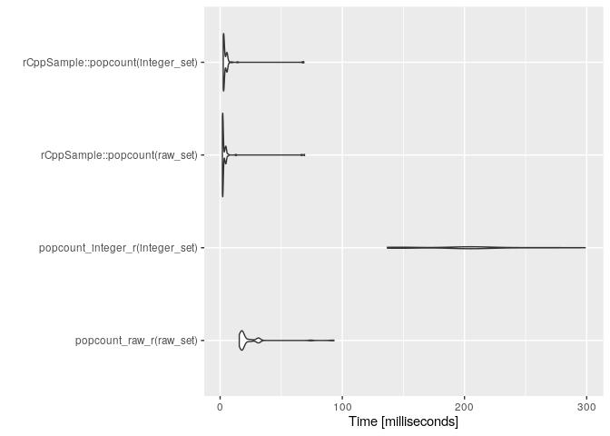

# A package with R and C++ extensions

## Quickstart

1.  Launch RStudio Server and login /r-studio-server.example.com:8787/
2.  Open rCppSample.Rproj
3.  Select the Build tab and click the Install and Restart button
4.  Select the Check button

## Install and run manually

### Build and install on a shell

``` bash
cd ~/work
R CMD build rCppSample
R CMD INSTALL rCppSample_0.0.0.9000.tar.gz
```

### Install on R

``` r
remotes::install_local("rCppSample_0.0.0.9000.tar.gz", dependencies = "Imports")
```

### Run

``` r
library(rCppSample)
rCppSample::popcount(as.raw(c(2, 255)))
rCppSample::popcount(c(1023, 1024, 1025))
```

## Testing

### R code

``` r
library(rCppSample)
devtools::test()
coverage_report <- covr::package_coverage()
print(coverage_report)
covr::report(coverage_report, "./coverage_report.html")
lintr::lint_package()
```

We can format R code pretty with the styler package.

``` r
styler::style_pkg()
```

### C++ code

``` bash
mkdir -p tests/build
cd tests/build
cmake ..
make
make test
cd ~/work/rCppSample/tests/build/CMakeFiles/test_popcount.dir
lcov -d . -c -o coverage.info
lcov -r coverage.info "/usr/*" "*/googletest/*" "/opt/boost*" -o coverageFiltered.info
genhtml -o lcovHtml --num-spaces 4 -s --legend coverageFiltered.info
```

We can use clang++ and AddressSanitizer in debugging.

    mkdir -p tests/build
    cp tests/ClangOverrides.txt tests/build/
    cd tests/build
    CXX=clang++ CC=clang cmake -DCMAKE_BUILD_TYPE=Debug -DCMAKE_USER_MAKE_RULES_OVERRIDE=ClangOverrides.txt ..
    make VERBOSE=1
    make test

C++ code in this package switches data types to export between this
package implementation and unit tests via the macro UNIT_TEST_CPP.
Launching R in C++ unit tests can avoid it. The unifdef command removes
UNIT_TEST_CPP blocks.

    find . -maxdepth 2 \( -name "*.cpp" -o -name "*.h" \) ! -name RcppExports.cpp -print0 | xargs --null -I '{}' sh -c 'unifdef -U UNIT_TEST_CPP "$1" > "$1".undef' -- '{}'
    find . -maxdepth 2 \( -name "*.cpp" -o -name "*.h" \) ! -name RcppExports.cpp -print0 | xargs --null -I '{}' sh -c 'cp "$1" "$1".def' -- '{}'
    find . -maxdepth 2 \( -name "*.cpp" -o -name "*.h" \) ! -name RcppExports.cpp -print0 | xargs --null -I '{}' sh -c 'cp "$1".undef "$1"' -- '{}'
    find . -maxdepth 2 \( -name "*.cpp" -o -name "*.h" \) ! -name RcppExports.cpp -print0 | xargs --null grep UNIT_TEST_CPP

We can format C++ code pretty with clang-format.

    find . -maxdepth 2 \( -name "*.cpp" -o -name "*.h" \) ! -name RcppExports.cpp -print0 | xargs --null -I '{}' sh -c 'clang-format -style="{IndentWidth: 4}" "$1" > "$1".new' -- '{}'
    find . -maxdepth 2 \( -name "*.cpp" -o -name "*.h" \) ! -name RcppExports.cpp -print0 | xargs --null -I '{}' sh -c 'diff --unified=0 "$1" "$1".new' -- '{}'

We can use clang-tidy to improve C++ code. Note that we have to run the
command below after installing Google Test.

    echo "-I $(find /usr -name R.h | head -1 | xargs dirname)" "$(Rscript -e 'cat(paste(paste0(" -I ", .libPaths(), "/Rcpp/include"), sep="", collapse=" "))')" "$(Rscript -e 'cat(paste(paste0(" -I ", .libPaths(), "/testthat/include"), sep="", collapse=" "))')" > _r_includes
    clang-tidy src/*.cpp tests/*.cpp -checks=perf\* -- -I src $(cat _r_includes) -I tests/build/googletest-src/googletest/include || echo "Non-zero exit code"

## Make documents

``` r
devtools::document()
rmarkdown::render("README.Rmd")
```

## Benchmarking

If the target is x86-64, make sure Makevars includes
`PKG_CXXFLAGS=-msse4.2` that lets compilers use the popcnt instruction.


<table>
<thead>
<tr>
<th style="text-align:left;">
method
</th>
<th style="text-align:left;">
median
</th>
<th style="text-align:left;">
ratio
</th>
</tr>
</thead>
<tbody>
<tr>
<td style="text-align:left;">
rCppSample::popcount(raw_set)
</td>
<td style="text-align:left;">
2.39230
</td>
<td style="text-align:left;">
1.00000
</td>
</tr>
<tr>
<td style="text-align:left;">
rCppSample::popcount(integer_set)
</td>
<td style="text-align:left;">
2.59605
</td>
<td style="text-align:left;">
1.08517
</td>
</tr>
<tr>
<td style="text-align:left;">
popcount_raw_r(raw_set)
</td>
<td style="text-align:left;">
16.25745
</td>
<td style="text-align:left;">
6.79574
</td>
</tr>
<tr>
<td style="text-align:left;">
popcount_integer_r(integer_set)
</td>
<td style="text-align:left;">
174.71225
</td>
<td style="text-align:left;">
73.03108
</td>
</tr>
</tbody>
</table>
